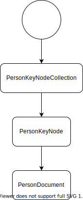

# Connector Documentation

This server as a documentation on how to write a connector. It will be accompanied by a sample API that we have
prepared. First you should install the requirements and set up the example code. Thereafter, we will continue with the
documentation, which is divided into the following parts:

1. Terminology
2. The target API
3. Create Derivation Tree (Client)
4. Create A Client
5. Create A Connector

## Requirements

Initially you should make sure you have the following installed:

- [Docker](https://www.docker.com/)
- Java 8
- [Kotlin](https://kotlinlang.org/)
- [Gradle](https://gradle.org/)

Additionally, you need to clone the following three repositories:

- [Sample API](https://github.com/datalbry/sample-api)
- [Sample API Client](https://github.com/datalbry/sample-api-client)
- [Sample API Connector](https://github.com/datalbry/sample-api-connector)

## Setup

Next we want to set up the three projects you previously pulled.

### Sample API

You need to get the docker image for the sample API up and running. To achieve this simply do the following from within
the project directory:

```shell
$ docker build -t sample-api .
$ docker run -p 8000:8000 sample-api
```

Now you should have the sample API ready on [http://127.0.0.1:8000](http://127.0.0.1:8000). You can easily verify it by
visiting [http://127.0.0.1:8000/docs](http://127.0.0.1:8000/docs). You should see there the FastAPI Swagger UI.


### Sample API Client

At best import it with your IDE of choice. More on that later.

### Sample API Connector

At best import it with your IDE of choice. More on that later.

## Terminology

<dfn>System</dfn>: A system can be anything that provides data. For example a system could be:

- REST/SOAP endpoint
- a file like a CSV
- a database

<dfn>Derivation Tree</dfn>: A derivation tree in this context is a graph structure, which defines the transitions from
objects. A transition means that with information from the parent you can retrieve the child from the target system. The
derivation tree does not necessarily need to be a tree.

<dfn>Connector</dfn>: A connector is a collection of processors which build the transitions on the derivation tree of
the system

## The target API

We have provided a small toy API for this documentation. You can explore it
on [http://127.0.0.1:8000/docs](http://127.0.0.1:8000/docs). The API has been kept simple on purpose.

In the end you should see, that there are in total 5 entities

- `Person`
- `Computer`
- `Project`
- `OfficePet`
- `PetToy`

and that there is a way to retrieve them from the API. For example, you can
call [http://127.0.0.1:8000/api/v1/persons](http://127.0.0.1:8000/api/v1/persons) to get all available instances
of `Person`.

## Create Derivation Tree (Client)

From this toy example it can be easily read how the entities are related.

- Without any information we get all `objectA`.
- From `objectA` we can then get all `objectB`.
- From `objectA` we can then get all `objectC`.
- Without any information we get all `objectX`.
- From `objectX` we can then get all `objectY`.

The **root**-Node marks the start. This would be a graphical representation of the structure we described just now.


## Create A Client

Next we need to create a client which can get us the data from the API. This has already been prepared for you. Now you
should open your IDE of choice with the Sample API Client project.

We split a client into two parts. An api and the actual implementation, like in the next image.


In the client-api are the models and the interfaces which specify the client fragments. In this case the client is split
into two parts. One for the person another for the office pet.


The models are identical to what the API provides us. This is because feign can thereby parse with jackson the returned
values.

The client then contains the actual implementation of the client fragments. As you can see in the next image, the
clients are separated into the implementation of the interfaces and a feign resources. This is to keep everything small
and manageable.


In the end is the `SampleApiClient` a facade (delegation of the client fragments).

To now actually use this client you firstly need to run the docker container with the API. Next you need to add in
your `~/.gradle/gradle.properties` the following line:

```
datalbry.sample.api.uri=http://127.0.0.1:8000/
```

First the gradle build script sets an environment variable from this property. This is because the configuration
requires of the client needs to know the URI of the API. If you choose a different port for the Sample API you can have
to adjust the port here accordingly.

In the test is a sample usage of the client. You can find the test
in `client/src/test/kotlin/io/datalbry/sample/api/client/feign/SampleApiClientTest.kt`.


If you now start the test, it should pass.

## Create A Connector

In DataLbry's Connector SDK a connector consists of multiple processors. A processor is something that processes an edge
and produces new nodes. From the previous tree a processor would take the root-node, process it and create a new node,
like the for example `Person`. You define for every edge a processor in your graph.

This section will also utilize the already implemented project. Now you should open the sample api connector in the IDE
of your choice.

### Building Blocks

The connector project usually is build by the following 5 blocks:

- <dfn>Processors</dfn>: Explained previously.
- <dfn>Document</dfn>: A Document is a searchable Record which has to have a globally unique identifier. Even amongst
  documents of different types.
- <dfn>Record</dfn>: A Record is a specifically annotated class which then can be stored in the backend.
- <dfn>KeyNode</dfn>: A KeyNode is basically an identifier in the terminology of a connector. KeyNodes are not stored in
  the backend.
- <dfn>KeyNodeContainer</dfn>: A KeyNodeContainer is a collection of KeyNodes. Usually you retrieve a collection of Ids
  like in the Sample API Client. We will see later how and why it's useful/necessary. KeyNodeContainer are not stored in
  the backend.

You may add utility functions or anything else. But the previously described blocks are the main part of connectors.

### Diving Into The Connector

Next we are going to dive into the connector and explore it step by step. We will add one element after another it.

#### First Processor

First you should check out to the branch `00-first-processor-person-document`

```shell
$ git checkout 00-first-processor-person-document
```

When you open the project you should see the following project structure:


What you should notice here is that:

- `config` package contains the properties which will be loaded via Spring and a connector config which will get the
  properties passed via dependency injection. This one expects

  

- `extensions` package contains extension functions of all sorts. Here we convert back and forth as we needed from the
  client to the Documents/Records/KeyNodes.

- `model` package contains all the Documents/Records/KeyNodes/KeyNodeContainer

- the processors are just lying in the `io.datalbry.sample.api.connector`.

How do we come from the client api to the KeyNodes, KeyNodeContainer and such?


The Container contains the KeyNodes, and they are annotated with `@Children`. This tells the Connector SDK that these
will be passed to the respective processor. You can't by itself return a collection of the KeyNodes and expect the
Connector SDK to pass them to the next processor. Later we will discuss another possibility on how to use
the `@Children` annotation.

Right now there are two processors:

- `RootToPersonKeyNodeCollectionProcessor`, from the naming schema you can conclude that this processor starts from the
  root node and produces a `PersonKeyNodeContainer`. It should be `Container` and not `Collection`.
- `PersonKeyNodeToPersonDocumentProcessor`, which takes a `PersonKeyNode` and produces a `PersonDocument`.

Both of them basically wrap the client and convert the objects. You can take a look.

This results at this step into the following derivation tree:



Before we continue it is good to mention testing right now. You should always of course test your code. Next we are
going to go through very simple integration tests which will basically verify the functionality.

- `src/test/kotlin/io/datalbry/sample/api/connector/extension/SampleApiConnectorTestExtension.kt`
- `src/test/kotlin/io/datalbry/sample/api/connector/SampleApiConnectorTest.kt`

Let's start with `SampleApiConnectorTestExtension`. This just set's the properties from the environment and is loaded
by `SampleApiConnectorTest`.


Next is the actual test.


1. This is setting up a docker container for data persistence
2. Here we use the previous extension
3. The path to the datasource. This is in this case set by the `ConnectorTestExtension`
4. The data persistence client `Alxndria`
5. The connector engine basically
6. You **HAVE TO REGISTER ALL DOCUMENTS AND RECORDS** here. Everything you want to persist into the backend has to be
   registered here!
7. Registering the data source at the given datasource identifier and the schemas.
8. Start the connector (propagating through the tree)
9. The propagation happens in the backend right now with an AMPQ channel. This is why we wait here. `awaitConvergence`
   waits for the number of elements (given by `await`) and checks every `steps` seconds if the size of the datasource
   does not change.
10. Then the test are run. Here we perform some test with this utility function.


This utility function fetches does:

- fetches all documents of the given type `DocumentType`
- checks if not empty
- checks if there is a document which contains the expected fields

#### Second Layer

For this part please check out at the branch `01-processing-second-layer-documents`

```shell
$ git checkout 01-processing-second-layer-documents
```

Now we are going to extend the connector and add documents which are deeper inside the API. Documents which are more or
less indirectly reachable. This means we will have more processors. So let's see what has been added.


Following has been added:

- Document, KeyNode and KeyNodeContainer about the Computer
- ProjectDocument and ProjectInformationRecord about the Project
- Extension functions to transform them
- Three new processors.

To remind you why there is no KeyNode and KeyNodeContainer for the Project: The API didn't offer us anything to access
it like this. So here the connector just fetches the list of Projects as the API provides us. Hence we just take the
`PersonKeyNode` and produce a collection of `ProjectDocument`s.

Also the tests habe been extended accordingly.

Lastly the derivation tree at this step looks like this:


#### Last Branch From Root

Lastly we have to cover the remaining part from the root node. For this part please check out at the
branch `02-processing-office-pets`

```shell
$ git checkout 02-processing-office-pets
```

This part of the documentation covers a case where we can retrieve a collection of documents. We don't have a
possibility to get them by their id. Hence we can't first get th KeyNodeCollection, then the KeyNode and lastly the
Document itself. In the case of the OfficePetDocument we will proceed as follows. The OfficePetDocument looks like this:


In this particular case we will include the KeyNode into the Document. The Connector SDK knows by the `@Children`
annotation that this value should be passed to another processor. Additionally, the `@Exclude` annotation prevents this attribute to persist into the final schema. Meaning that the `keyNode` will not appear in the database.


## Sources

- To create the graphs we used this extension for IntelliJ
  IDEA: [https://plugins.jetbrains.com/plugin/15635-diagrams-net-integration](https://plugins.jetbrains.com/plugin/15635-diagrams-net-integration)